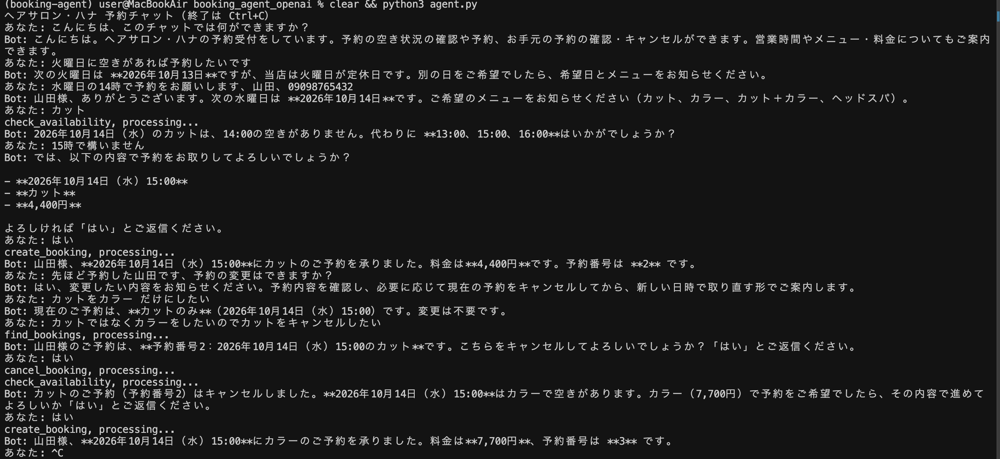

# 予約受付エージェント（ヘアサロン向けデモ）

小さなお店の予約受付を、チャットで自動化する AI エージェントです。
空き枠の確認、予約、キャンセルを行い、クレームや健康に関わる相談は店主に引き継ぎます。

## デモ


## 設計
- **モデル:** OpenAI Responses API（ツール呼び出し）、ツール呼び出しのループは自前で実装（`agent.py`）
- **ツール:** `get_shop_info` / `check_availability` / `create_booking` / `find_bookings` / `cancel_booking` / `handoff_to_owner`
- **データ:** SQLite（本番の予約システムの代わりのモック、`db.py`）
- **人間が判断するところ:** クレーム、返金、健康、メニュー外の要望は `handoff_to_owner` で店主へ
- **安全策:** 予約の確定前に必ず復唱して同意を取る。空き状況はツールの結果だけを根拠にする。二重予約はデータベース側でも防ぐ

## 評価
`python run_eval.py` でテスト会話を流し、データベースの状態で自動採点します。

| 指標 | 結果 |
|---|---|
| 合格率 | 【○/30】 |
| 1会話あたりのコスト | 【$○】 |


## 本番で使うなら
- 個人情報（名前、電話番号）の保存と削除のルール
- 本物の予約システムの API との接続、同時予約の排他制御
- LINE や Web サイトへの組み込み、コストの上限設定

## 動かし方
```bash
pip install -r requirements.txt
export OPENAI_API_KEY=...
export OPENAI_MODEL=...   # 使うモデル名
python agent.py      # チャット
python run_eval.py   # 評価
```
